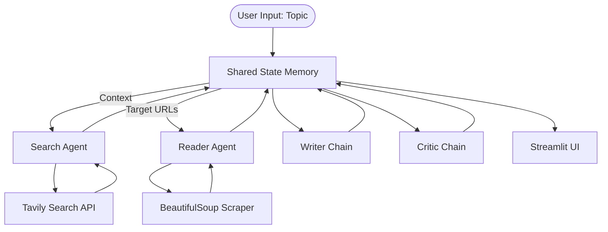

# Multi Agent AI Research System

An agentic workflow that automates web research — searching, scraping, synthesizing, and critiquing reports on any topic. Built with **LangChain (LCEL)**, **Mistral AI**, and **Streamlit**.

## 🛠️ Architecture

ResearchMind uses a **shared state (blackboard) pattern** to coordinate a team of agents and chains instead of passing raw prompt strings between calls.



**Pipeline:**
1. **Search Agent** — queries the Tavily API (`max_results=5`) for relevant sources.
2. **Reader Agent** — scrapes target URLs with BeautifulSoup4 (spoofed headers, 8s timeout, boilerplate stripped, 3,000-word cap per page).
3. **Writer Chain** — synthesizes a Markdown report (summary, key findings, conclusion, bibliography).
4. **Critic Chain** — scores the report (0–10) and returns structured JSON feedback (strengths, gaps, verdict).
5. **Streamlit UI** — displays and lets users download the final report.

## 💻 Tech Stack

| Layer | Tool |
|---|---|
| Orchestration | LangChain (`create_agent`, LCEL) |
| LLM | Mistral AI |
| Search | Tavily Search API |
| Scraping | BeautifulSoup4 + Requests |
| UI | Streamlit |
| Logging | Rich |
| Config | python-dotenv |

## 📂 Project Structure

```
multi_agent_system/
├── .env                  # API credentials (not committed)
├── requirements.txt
├── tools.py              # Tavily search + BS4 scraping tools
├── agents.py             # Agent + LCEL Writer/Critic chains
├── pipeline.py           # Orchestration & shared state
└── app.py                # Streamlit dashboard
```
